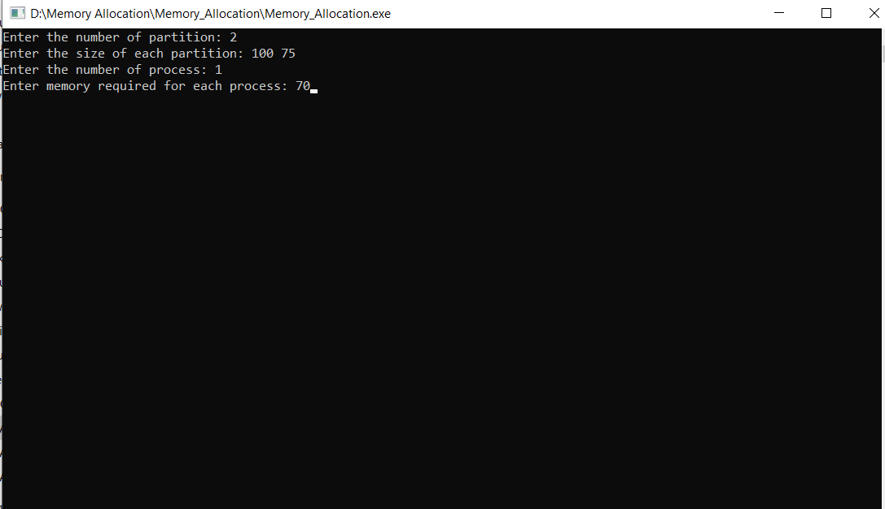

# 💾 **C++ Memory Allocation Simulator**

A **C++ console application** that simulates and *visually compares* four fundamental dynamic memory allocation algorithms: **First Fit**, **Next Fit**, **Best Fit**, and **Worst Fit**.

This project provides a *hands-on demonstration* of core operating system concepts, showing how different strategies for managing memory partitions can lead to vastly different outcomes in **efficiency** and **fragmentation**.

---

## 🎥 **Live Demo**

Watch a complete walkthrough of the program, from compilation to final results.  
Click the demo video below to see the simulator in action:

* **Demo Video:** [Video Link]([https://drive.google.com/file/d/13EnhYpwlayN0PZObUm-W7KbJ0GFztp7Y/view?usp=sharing](https://drive.google.com/file/d/1hPS4cf4gHdA1Lekhv0y9Ncr6Wgeg4ayO/view?usp=sharing))


---

## 🚀 **Key Features**

This program implements and compares **four classic algorithms**:

- **First Fit** — Allocates the *first* memory partition that is large enough to hold the process. It's *fast*, but can leave unusable small fragments.  
- **Next Fit** — Similar to First Fit, but starts its search *from where the last allocation occurred*, wrapping around the memory blocks.  
- **Best Fit** — Scans the entire set of partitions and allocates the *smallest block* that is large enough. This *minimizes internal fragmentation* for that allocation.  
- **Worst Fit** — Scans all partitions and allocates the *largest available block*. The idea is to leave a large usable fragment, but it can quickly "pollute" the large blocks.

---

## ⚙️ **How It Works**

The simulation runs in a simple, two-phase process:

### 🧩 *Input Phase*
The user is prompted to define the environment:
- Enter the *total number of available memory partitions* and the *size of each one*.
- Enter the *number of processes* waiting in the queue and the *memory size required* for each.

### 💡 *Allocation Phase*
The program automatically runs all four algorithms on separate, identical copies of the memory environment.

### 📊 *Results Phase*
For each algorithm, the program prints a detailed report showing:
- Which process was allocated to which partition.  
- Which processes could **not** be allocated.  
- The total **internal fragmentation** (wasted space) for that algorithm.

---

## 📸 **Simulation Screenshots**


1. *Defining the memory & processes (input screen)*  
2. `images/first_fit_results.png` — *First Fit Algorithm results*  
3. `images/best_fit_results.png` — *Best Fit Algorithm results*  
4. `images/worst_fit_results.png` — *Worst Fit Algorithm results*

---

## 🛠️ **Tech Stack**

- **Language:** C++  
- **Core Libraries:** `iostream`, `vector`, `cstdlib` (for `system("pause")` if desired)  
- **Compiler:** `g++` (MinGW-w64 recommended for Windows)  
- **IDE:** Visual Studio Code (recommended extensions: C/C++)  
- **Core Concepts Demonstrated:** Pointers, dynamic memory, structs, algorithmic strategies, fragmentation metrics.

---

## ⚡ **How to Compile & Run**

You can compile and run this project from any C++ enabled terminal.

### 1. Prerequisites
- **Git** (optional, for cloning)  
- **g++ Compiler** (MinGW-w64 on Windows, or `build-essential` on Linux)

### 2. Clone the repository
```bash
git clone https://github.com/smeetpatel2530/Cpp-Memory-Allocator.git
cd Cpp-Memory-Allocator
```
### 3. Compile the code
```bash
g++ -o Memory_Allocation.exe Memory_Allocation.cpp
```
### 4. Run the program
```bash
./Memory_Allocation.exe
```
## 🧪 Example Test Case (Paste into terminal when prompted)
```bash
Enter the number of partition:
8
Enter the size of each partition:
80 100 150 247 78 54 179 136
Enter the number of process:
8
Enter memory required for each process:
90 48 87 169 190 110 25 50
```
The program will run all four simulations and print results for each, including allocations and total internal fragmentation.
---
## 📄 What the Output Shows
- A list mapping process → partition for each algorithm.
- A list of unallocated processes (if any).
- Total internal fragmentation (sum of wasted spaces within allocated partitions) for each algorithm — useful to compare strategy efficiency.
---
## 🧾 Notes & Tips
- The program uses separate copies of the partition list for each algorithm so comparisons are fair and independent.
- You may optionally remove system("pause") if you prefer not to pause at the end (commonly removed for UNIX environments).
- To add a Next Fit visualization, ensure the simulator persists the last allocation pointer between allocations of the same simulation.

---
## ✨ Contributing
If you'd like to contribute:
1.Fork the repo.
2.Create a feature branch: git checkout -b feature/your-feature
3.Commit your changes: git commit -m "Add <your-feature>"
4.Push to the branch and open a pull request.
---
